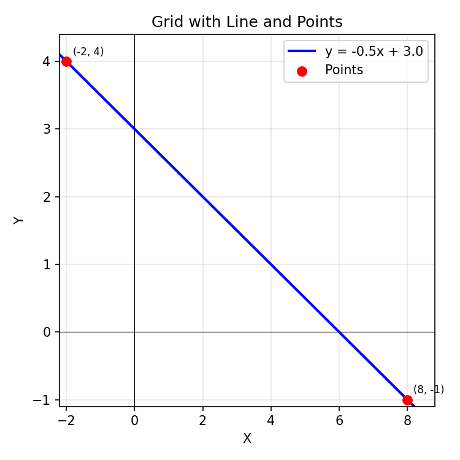
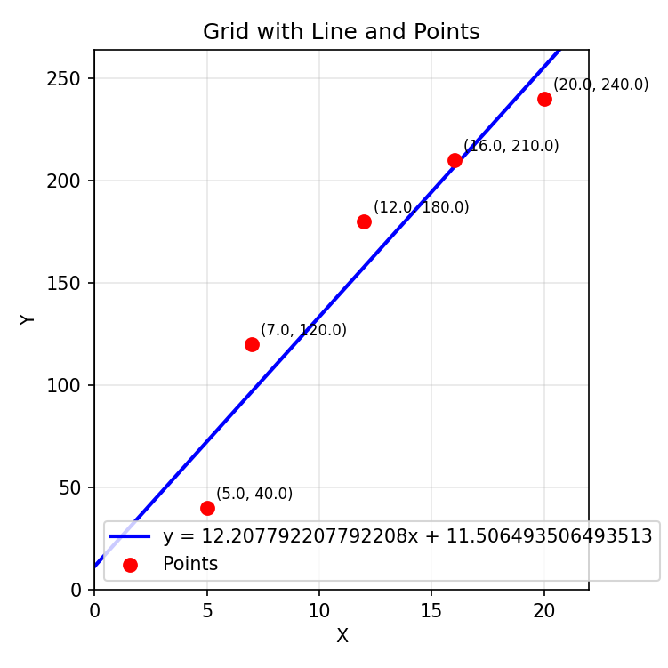

# Linear Regression

With linear regression, we are able to calculate a value on the Y-axis based on the input on the X-axis. The functional curve of this mathematical operation is a straight with the formula `m * X + b = Y`. Based on some data, in our case trainingdata, the parameters m and b are adjusted to pass through the data cloud with the minimum error.

To find the best fitting straight for to points is pretty straight forward:
- Calculate Delta between two points `m = (point_a.Y - point_b.Y) / (point_a.X - point_b.X)` to get gradient m
- insert values of either point a or b in equation `m * X + b = Y` with the new infromation m
- transform equation by subtracting `m * X` to receive `b = point_a.Y - (point_a.X * m)`

The formula stays (nearly) the same for calculating the straight with multiple points.
- Calculate average x an y for all points
- Calcualte the sum of cross-products and sum of squared deviations from the mean. In this step, the difference from the averge point to the rest of the points gets calculated. Dividing these numbers results in the slope m.
- Inserting m, average x and average y in to the formula `b = Y - (X * m)`

# Code
I created